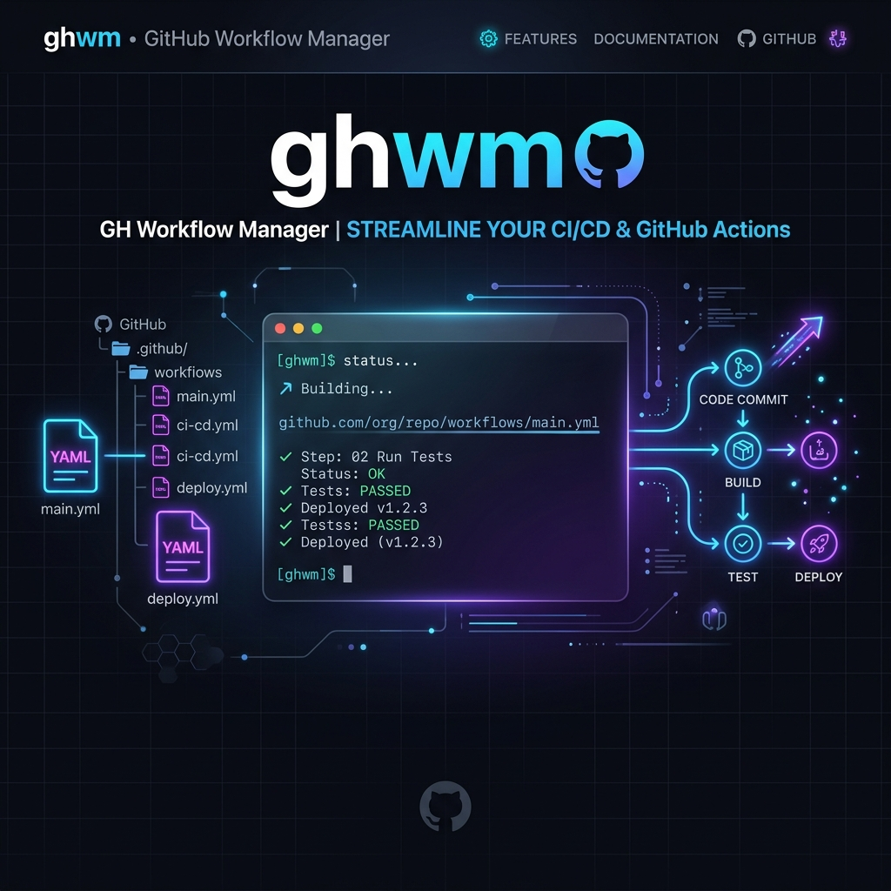

# GitHub Workflow Manager CLI

[](https://github.com/pljanicki/ghwm/actions/workflows/linter.yaml)
[](https://github.com/pljanicki/ghwm/releases/latest)
[](https://codecov.io/gh/pljanicki/ghwm)
[](https://www.python.org/)

|  |
| :-------------------------------------------: |

> Install managed GitHub workflow files from a central marketplace repository.

Workflows are sourced from [owner/ghwm-marketplace](https://github.com/owner/ghwm-marketplace).

## Install

The recommended way to install `ghwm` is using [uv](https://docs.astral.sh/uv/) (a fast Python package manager):

```sh
uv tool install git+https://github.com/pljanicki/ghwm.git
```

Or pin to a specific version tag:

```sh
uv tool install git+https://github.com/pljanicki/ghwm.git@vX.Y.Z
```

### Alternatives

If you prefer to install using [pipx](https://github.com/pypa/pipx):

```sh
pipx install git+https://github.com/pljanicki/ghwm.git
```

Or via standard `pip` (into an active virtual environment):

```sh
pip install git+https://github.com/pljanicki/ghwm.git
```

## Usage

### 1. Create `ghwm.yml` in your repository root

```yaml
source: owner/ghwm-marketplace

workflows:
  - name: linter
    version: "1.0.0"
  - name: auto-assign-pr
    version: "1.0.0"
    update-triggers: true
    update-config-files: true
```

`version` is required for registry installs. The CLI resolves each workflow to a GitHub Packages npm
package named `@<source owner>/ghwm-<name>`.

If you want to override the generated workflow filename, add `target: my-review.yml` to the
workflow entry.

### 2. Install workflows

```sh
ghwm install            # installs workflows listed in ghwm.yml
ghwm install --force    # overwrites even if files were modified locally
ghwm install --no-prune # skip removal of stale workflows
ghwm install --update-triggers # replace workflow triggers with the packaged version
ghwm update             # re-downloads all workflows (respects versions)
ghwm update --prune     # also removes managed workflows no longer in ghwm.yml
ghwm update --update-triggers # replace workflow triggers with the packaged version
ghwm list               # shows workflows declared in ghwm.yml
ghwm audit              # audits managed workflows for security vulnerabilities
```

Workflow files are written to `.github/workflows/` with a managed header. Additional packaged files
such as config files are written as-is. On first install, config files are only created if the target
does not already exist. On update, config files are only overwritten when
`update-config-files: true` is set for that workflow.

| File type                             | First install               | Update                                              | Prune  |
| ------------------------------------- | --------------------------- | --------------------------------------------------- | ------ |
| Workflow file (`.github/workflows/*`) | Install with managed header | Update in place; preserve existing `on:` by default | Remove |
| Packaged config file                  | Create only when missing    | Overwrite only with `update-config-files: true`     | Keep   |

#### Managed files

Every installed workflow file starts with a header that marks it as managed:

```yaml
# Managed by ghwm (linter@0.1.4)
# Source: @owner/ghwm-linter:linter.yml
# Hash: sha256:...
# Re-run `ghwm install` to refresh this file.
```

The CLI uses this header to:

- Distinguish managed files from hand-crafted ones (unmanaged files are never
  overwritten without `--force`).
- Preserve existing `on:` rules during updates unless `update-triggers: true`
  or `--update-triggers` is used.
- Prune stale workflow files that were removed from the manifest.

Config files do not get a managed header and are never removed during prune.

Use `ghwm update --prune` when you want one command to refresh workflows that are still in
`ghwm.yml` and remove managed workflows that were deleted from the manifest. It updates
`ghwm.lock` too.

#### Lockfile

`ghwm.lock` is a JSON file that records every installed package and the files it manages:

```json
{
  "lockfileVersion": 1,
  "packages": [
    {
      "name": "auto-assign-pr",
      "version": "2.0.0",
      "source": "@owner/ghwm-auto-assign-pr",
      "files": [
        {
          "target": ".github/workflows/auto-assign-pr.yaml",
          "source_hash": "sha256:..."
        },
        {
          "target": ".github/auto_assign.yaml",
          "source_hash": "sha256:...",
          "overwrite": false
        }
      ]
    }
  ]
}
```

Commit `ghwm.lock` alongside `ghwm.yml` so CI and teammates install the exact same
workflow package set. Old tarball-era lockfiles are rejected and must be regenerated.

## Auditing Workflows (Security Scoring)

Since workflows are imported from shared marketplace repositories, keeping them secure is critical. The `ghwm audit` command runs static security analysis on all your installed/managed workflows using [zizmor](https://docs.zizmor.sh) (a fast security linter for GitHub Actions).

```sh
ghwm audit
```

If the linter is not installed locally, `ghwm` will attempt to execute it dynamically using `uvx zizmor`.

`ghwm audit` calculates a **Security Score** out of 100 on a logarithmic scale (exponential decay) to ensure the score never goes negative:

$$\text{Score} = \text{round}\left(100 \times e^{-\text{Deductions} / 100}\right)$$

where total Deductions are calculated from:

- **High severity**: 20 points
- **Medium severity**: 10 points
- **Low severity**: 5 points
- **Informational**: 1 point

If any High or Medium severity vulnerabilities are detected, `ghwm audit` exits with code `1`, making it ideal for integration into CI pipelines.

## Keep Workflows Updated (Renovate Integration)

Since `ghwm` resolves workflows to npm packages (e.g., `@owner/ghwm-<name>`) published to GitHub Packages, you can use **Renovate** to automatically detect updates and open pull requests to update the versions in your `ghwm.yml`.

Add the following `regexManagers` configuration to your `renovate.json` or `renovate.json5` file:

```json
{
  "regexManagers": [
    {
      "fileMatch": ["^ghwm\\.yml$"],
      "matchStrings": [
        "name:\\s+(?<depName>\\S+)\\s+version:\\s+[\"']?(?<currentValue>[^\"'\\s]+)[\"']?"
      ],
      "datasourceTemplate": "npm",
      "depNameTemplate": "@owner/ghwm-{{depName}}",
      "registryUrlTemplates": ["https://npm.pkg.github.com"]
    }
  ]
}
```

_Note: Replace `@owner` with the GitHub organization or username where your marketplace packages are published._

### Authentication

The CLI needs read access to GitHub Packages and the marketplace repository. The CLI looks for authentication in the following order:

1. Active `gh` CLI credentials (using the output of `gh auth token`)
2. `GH_TOKEN` environment variable
3. `GITHUB_TOKEN` environment variable

> [!IMPORTANT]
> When setting up a public marketplace repository, ensure that the visibility of the published packages on GitHub Packages is explicitly changed from **Private** to **Public**. If they remain private, external consumers running `ghwm install` will fail with `404 Not Found` or `401 Unauthorized` errors.

For example, you can set an environment variable:

```sh
export GH_TOKEN=ghp_...
# or
export GITHUB_TOKEN=ghp_...
```

If you rely on the `gh` CLI, ensure that its active token has `read:packages` access. You can add this scope if needed by running:

```sh
gh auth refresh -s read:packages
```

### Local Development

Point at a local checkout of the marketplace for testing:

```sh
ghwm install --local ../ghwm-marketplace
```

With `--local`, the CLI reads `workflows/<name>/workflow.yml` directly from the checkout instead of
downloading the npm package tarball.

## Development

```sh
make install          # uv sync (dev deps)
make test             # pytest
make lint             # ruff check
make format           # ruff format
make type-check       # mypy
make lang             # textlint for prose/documentation
make precommit        # run pre-commit hooks on all files
make super-linter     # run super-linter via Docker
make clean            # remove build artifacts
```

## Architecture

See [ARCHITECTURE.md](docs/ARCHITECTURE.md) for design details.

## License

MIT
