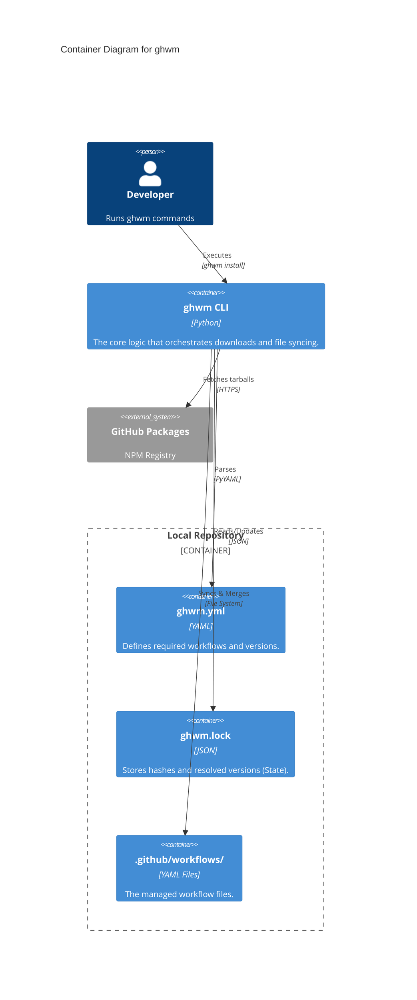
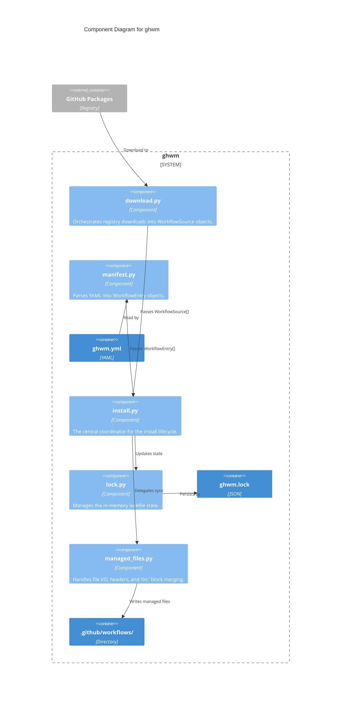

# Architecture

## Overview

`ghwm` is a command-line tool that installs GitHub Actions workflow
files from a central marketplace repository into a consumer repository. It
follows a **manifest → download → install → lock** lifecycle, analogous to a
package manager.

```text
ghwm.yml          GitHub Packages npm registry
(consumer manifest)  ──▶  npm tarball download (per package + version)
        │                          │
        ▼                          ▼
  WorkflowEntry[]          WorkflowSource[]
        │                          │
        └──────────┬───────────────┘
                   ▼
          install_workflows()
                   │
        ┌──────────┴──────────┐
        ▼                     ▼
  .github/workflows/    ghwm.lock
  (managed YAML files)  (JSON lockfile)
```

### C4 Model - Container Diagram



### C4 Model - Component Diagram



## Component map

| Module             | Responsibility                                                              |
| ------------------ | --------------------------------------------------------------------------- |
| `cli.py`           | Argument parsing; entry point for `ghwm`                                    |
| `manifest.py`      | Parse `ghwm.yml` into `Manifest` / `WorkflowEntry` objects                  |
| `download.py`      | Download orchestration; local checkout reads; auth token resolution         |
| `download_npm.py`  | GitHub Packages tarball download, package manifest parsing, file extraction |
| `managed_files.py` | Low-level workflow/config file sync, trigger merge, prune checks            |
| `install.py`       | Orchestrate install/update/prune; delegate file ops to `managed_files`      |
| `lock.py`          | Read and write `ghwm.lock` (JSON); in-memory lockfile operations            |
| `package_names.py` | Helpers to compute scoped npm package names from org and workflow name      |
| `paths.py`         | Path security utilities including path traversal checks                     |

## Workflow lifecycle

### 1 — Manifest parsing (`manifest.py`)

`ghwm.yml` is a YAML file in the consumer repository root. The parser
produces a `Manifest` containing a list of `WorkflowEntry` objects. Each entry
carries:

- **name** — workflow identifier.
- **version** — SemVer string (required for remote installs).
- **target** (optional) — custom filename for the installed workflow file.
- **update-triggers** (optional) — replace the existing `on:` block on update when `true`.
- **update-config-files** (optional) — overwrite packaged config files on update when `true`.

The manifest also declares a **source** in `owner/repository` form. The owner
becomes the npm scope: `owner/ghwm-marketplace` →
`@owner/ghwm-<name>`.

Version resolution produces a `resolved_ref` string used directly as the npm
package version. An explicit version is required; omitting it for a remote
install is an error.

### 2 — Download (`download.py`, `download_npm.py`, `package_names.py`)

Each workflow maps to a scoped GitHub Packages npm package:

```text
@<owner>/ghwm-<name>@<version>
```

For each workflow, the tool:

1. Fetches package metadata from `https://npm.pkg.github.com/@<owner>/ghwm-<name>`.
2. Resolves the `dist.tarball` URL for the requested version.
3. Downloads the `.tgz` tarball.
4. Reads `package/workflow.yml` from the tarball to get the `files` list.
5. Extracts each declared file and builds `InstalledFile` objects.

Authentication priority:

1. `GH_TOKEN` / `GITHUB_TOKEN` environment variable.
2. `gh auth token` — used when the `gh` CLI is on `PATH` and the env vars are absent.

Tokens must have `read:packages` scope.

**Local development mode** (`--local`) skips the network entirely and reads
`workflows/<name>/workflow.yml` plus the files it declares directly from a
local marketplace checkout. The same `InstalledFile` abstraction is used for
both paths.

### 3 — File sync (`managed_files.py`)

`managed_files.py` owns all low-level file management. It distinguishes two
categories:

**Workflow files** (targets under `.github/workflows/`):

1. Decode the source content as UTF-8.
2. On update, preserve the existing `on:` block unless `update-triggers` is enabled.
3. Normalize the body (strip trailing whitespace, ensure trailing newline).
4. Compute `sha256` of the normalized body — this is the **source hash**.
5. Prepend a four-line managed header (name@version, source path, hash, refresh hint).
6. Write if content changed; skip otherwise.

**Config files** (any other target path):

- First install: create only when the target does not already exist.
- Update: overwrite only when `update-config-files: true` is set; otherwise keep the existing file.

Both paths return an `_InstalledFileResult` with `changed` and an optional
`LockFileEntry`.

**Managed header format** (four lines, no empty line before the body):

```yaml
# Managed by ghwm (<name>@<version>)
# Source: @<org>/ghwm-<name>:<source-file>
# Hash: sha256:<hex>
# Re-run `ghwm install` to refresh this file.
```

### 4 — Install orchestration (`install.py`)

`install_workflows()` coordinates the full lifecycle:

1. Read the lockfile.
2. Call `download_workflows()` to obtain `WorkflowSource` objects.
3. For each `WorkflowEntry`, call `_install_one()`:
   - Sort files so workflow files are processed before config files.
   - Delegate each file to `_sync_workflow_file` or `_sync_config_file`.
   - Accumulate `LockFileEntry` objects and upsert into the lockfile.
4. If `prune=True`, call `_prune_stale()` to remove managed workflow files no
   longer in the manifest.
5. Write the updated lockfile.

**Pruning** only removes workflow files (`.github/workflows/`). Config files
are always left in place. A modified managed file (changed hash) is not pruned
unless `--force`.

### 5 — Lockfile (`lock.py`)

`ghwm.lock` (version 1) is committed alongside `ghwm.yml`:

```json
{
  "lockfileVersion": 1,
  "packages": [
    {
      "name": "auto-assign-pr",
      "version": "2.0.0",
      "source": "@owner/ghwm-auto-assign-pr",
      "files": [
        {
          "target": ".github/workflows/auto-assign-pr.yaml",
          "source_hash": "sha256:<hex>"
        },
        {
          "target": ".github/auto_assign.yaml",
          "source_hash": "sha256:<hex>",
          "overwrite": false
        }
      ]
    }
  ]
}
```

Package-level fields:

| Field     | Description                                    |
| --------- | ---------------------------------------------- |
| `name`    | Workflow identifier (matches manifest entry)   |
| `version` | Pinned version                                 |
| `source`  | Scoped npm package name (`@org/ghwm-<name>`)   |
| `files`   | Array of file entries tracked for this package |

Per-file fields:

| Field         | Description                                                       |
| ------------- | ----------------------------------------------------------------- |
| `target`      | Relative path of the installed file in the consumer repository    |
| `source_hash` | `sha256:<hex>` of the normalized body written to disk             |
| `overwrite`   | `false` for config files that should not be overwritten on update |

Old lockfiles (version ≠ 1) are rejected; delete and re-run `ghwm install`.

The lockfile is deleted automatically when all packages are removed.

### 6 — Security auditing (`cli.py`)

`run_audit()` performs static security analysis on the managed workflow files:

1. Read `ghwm.lock` to find all currently managed files.
2. Filter the tracked files to locate only workflow files (targets under `.github/workflows/`).
3. Run [zizmor](https://docs.zizmor.sh) (locally or via `uvx zizmor`) on all detected files.
4. Parse the resulting security findings, ignoring any marked as `ignored`.
5. Calculate a **Security Score** starting at 100/100, deducting points based on findings:
   - **High severity**: Deducts 20 points
   - **Medium severity**: Deducts 10 points
   - **Low severity**: Deducts 5 points
   - **Informational**: Deducts 1 point
6. If any High or Medium severity findings are present, exit with code `1` to fail CI builds.

## CLI command flow

```text
argv
  └─▶ _build_parser()            # argparse setup
        └─▶ args                 # parsed namespace
              ├─▶ read_manifest()
              │     └─▶ parse_manifest()      → Manifest
              ├─▶ install_workflows()         → InstallResult
              │     ├─▶ read_lockfile()       → Lockfile
              │     ├─▶ download_workflows()  → [WorkflowSource]
              │     │     └─▶ download_npm_tarball() / read_local()
              │     ├─▶ _install_one() × N
              │     │     ├─▶ _sync_workflow_file()
              │     │     └─▶ _sync_config_file()
              │     ├─▶ _prune_stale()
              │     └─▶ write_lockfile()
              ├─▶ update_workflows()   (install_workflows, prune=False)
              ├─▶ list  (prints manifest entries, no download)
              └─▶ audit (audits managed workflows via zizmor)
```

## Versioning and update strategy

| Command   | Downloads                  | Prunes stale | Honours pinned versions |
| --------- | -------------------------- | ------------ | ----------------------- |
| `install` | Yes (missing/changed only) | Yes          | Yes                     |
| `update`  | Yes (all)                  | No           | Yes                     |
| `list`    | No                         | No           | —                       |
| `audit`   | No                         | No           | —                       |

Running `install` twice is idempotent: the second run skips all up-to-date
workflows.

## Planned features

- **`remove` command** — remove a single managed workflow and its lock entry.
- **Auto-update** — renovate-style PRs when new marketplace versions are tagged.
