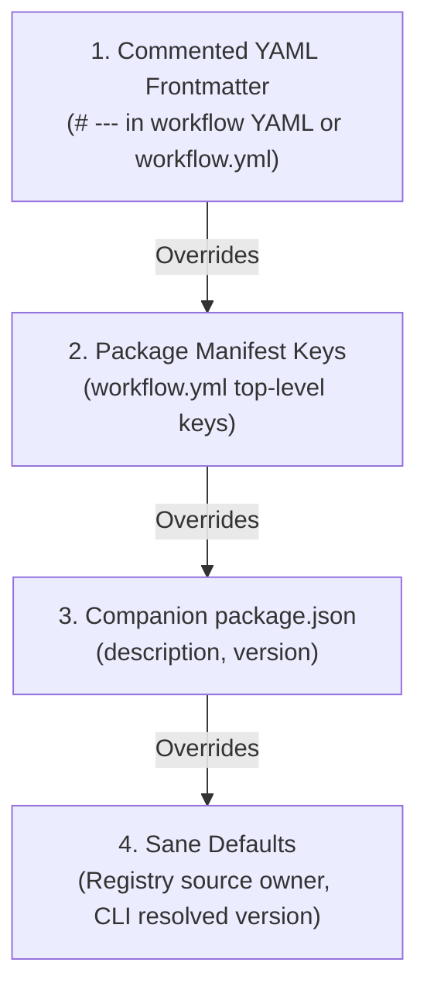

# Workflow Frontmatter Metadata Specification

This specification defines the syntax, schema, resolution precedence, and authoring guidelines for workflow presentation metadata embedded via commented YAML frontmatter blocks (`# ---` ... `# ---`).

---

## Overview

Workflows distributed through `ghwm` registries (such as [ghwfxlab/ghwm-registry](https://github.com/ghwfxlab/ghwm-registry)) can define structured presentation metadata directly within their workflow YAML files.

Embedding metadata inside commented frontmatter blocks provides three key benefits:

1. **Zero Runtime Impact**: Because the metadata block consists entirely of YAML comments (`#`), GitHub Actions runners ignore it during execution. It introduces zero execution overhead or behavior changes to the workflow.
2. **Universal Compatibility**: The format is 100% compatible with GitHub Actions workflow parsers, syntax validators, and strict linters (such as `yamllint` and `actionlint`).
3. **Rich Registry Presentation**: Registry web portals, marketplace catalogs, search indexers, and the `ghwm` CLI can extract rich presentation metadata—including human-friendly titles, descriptions, categorized tags, icons, ownership, and creation timestamps.

---

## Syntax and Delimiters

Commented frontmatter must be placed at the **very top of the workflow file**, immediately preceding the standard GitHub Actions YAML document start delimiter (`---`) or the workflow root keys (e.g., `name:`).

### Syntax Format

```yaml
# ---
# title: Super-Linter
# description: Code linting workflow using Super-Linter and pre-commit hooks for code quality.
# tags:
#   - lint
#   - actions
#   - pre-commit
# icon: fact_check
# owner: ghwfxlab
# ---
---
name: Lint Code Base

on:
  push:
    branches: [main]
  pull_request:

jobs:
  lint:
    runs-on: ubuntu-latest
    steps:
      - uses: actions/checkout@v4
```

### Delimiter Rules

- **Opening Delimiter**: `# ---` must be the first non-empty line of the file.
- **Closing Delimiter**: `# ---` terminates the frontmatter block.
- **Line Prefixing**: Every line within the frontmatter block must begin with `#` (optionally followed by a space).
- **YAML Content**: The text following the `#` prefix (and optional space) forms standard YAML mapping syntax.

> [!NOTE]
> `ghwm` also supports top-of-file comments without explicit `# ---` delimiters as a graceful fallback. However, registry authors must use the explicit `# ---` delimiters for clarity and deterministic parsing across external tools.

---

## Metadata Schema

The following table defines the supported metadata fields, data types, length constraints, descriptions, and default fallback values:

| Field | Type | Required | Max Length | Description | Default / Fallback |
| :--- | :--- | :--- | :--- | :--- | :--- |
| `title` | string | No | 128 chars | Human-readable workflow display title. | Fallback to manifest `title` or prettified workflow name. |
| `description` | string | No | 2048 chars | Concise summary of the workflow purpose and capabilities. | Fallback to manifest `description` or `package.json` `description`. |
| `tags` | string[] | No | 20 items (64 chars each) | Categories, keywords, or topics for search and filtering. | Fallback to manifest `tags` or empty list `[]`. |
| `icon` | string | No | 64 chars | Google Material Symbols icon identifier. | Fallback to manifest `icon` or default icon (e.g., `extension`). |
| `owner` | string | No | 128 chars | Workflow publisher, maintainer, or organization name. | Fallback to manifest `owner` or derived registry owner segment (`owner/repo`). |
| `version` | string | No | 64 chars | Semantic version of the workflow package. | Fallback to resolved CLI version, manifest `version`, or `package.json` `version`. |
| `created_at` | string | No | 64 chars | ISO 8601 creation or publication timestamp. | Fallback to manifest `created_at` / `createdAt` or omitted (`null`). |

---

## Field Details and Constraints

### `title`

A concise, human-friendly display name for the workflow.

- **Type**: `string`
- **Max Length**: 128 characters (longer values are truncated).
- **Example**: `title: Super-Linter`
- **Recommendation**: Use title case and avoid redundant suffixes like "Workflow".

### `description`

A descriptive overview of what the workflow performs, prerequisites, or key tools involved.

- **Type**: `string`
- **Max Length**: 2048 characters (longer values are truncated).
- **Example**:

  ```yaml
  # description: Automated security scanning workflow running zizmor static analysis on GitHub Actions workflows.
  ```

- **Line Length**: For multiline descriptions, conform to standard YAML linter constraints (`<= 120` characters per line) by wrapping lines or using YAML folded block scalars (`>`).

### `tags`

A list of tags, categories, or keywords for discovery and classification.

- **Type**: `string[]` (list of strings, comma-separated string, or JSON array string).
- **Constraints**: Maximum 20 unique tags; each tag is truncated to 64 characters. Duplicates are removed.
- **Examples**:

  ```yaml
  # tags:
  #   - security
  #   - audit
  #   - actions
  ```

  Or compact list format:

  ```yaml
  # tags: [security, audit, actions]
  ```

### `icon`

Visual identifier representing the workflow in UI registries and catalogs.

- **Type**: `string`
- **Max Length**: 64 characters.
- **Format**: [Google Material Symbols](https://fonts.google.com/icons) identifier in snake_case.
- **Examples**:
  - `fact_check` — Linters, formatters, and code quality checkers
  - `security` — Vulnerability scanners and security auditors
  - `rocket_launch` — Deployment and release automation
  - `person_add` — Issue/PR assignment and triage
  - `bolt` — Fast test runners and CI builds
  - `terminal` — Command-line utilities and script runners
  - `extension` — General marketplace plugins and extensions

### `owner`

The organization or individual maintaining the workflow package.

- **Type**: `string`
- **Max Length**: 128 characters.
- **Example**: `owner: ghwfxlab`
- **Default**: If omitted, defaults to the owner portion of the workflow registry repository (`owner` from `owner/ghwm-registry`).

### `version`

The version of the workflow package.

- **Type**: `string`
- **Max Length**: 64 characters.
- **Format**: Semantic Versioning string (e.g., `1.0.0`, `2.1.4`).
- **Resolution**: Typically supplied during publication or resolved dynamically by the package manager.

### `created_at` / `createdAt`

The creation or initial release timestamp.

- **Type**: `string`
- **Max Length**: 64 characters.
- **Format**: ISO 8601 UTC timestamp format (e.g., `2026-09-20T10:00:00Z`).
- **Aliases**: Supported under either `created_at` (snake_case) or `createdAt` (camelCase).

---

## Resolution Precedence Hierarchy

When `ghwm` extracts metadata for a workflow package during download or local read operations, it applies a four-tier precedence hierarchy:



1. **Commented YAML Frontmatter**: Frontmatter defined inside the package's primary workflow YAML file (or `package/workflow.yml`) takes highest precedence.
2. **Top-Level Manifest Keys**: Explicit top-level keys declared in `package/workflow.yml` (e.g., `title: ...`, `icon: ...`).
3. **`package.json` Fields**: Companion `package.json` metadata fields (`description`, `version`) when present in the package tarball.
4. **Sane Defaults**: Automatic fallbacks derived from the resolved package source (e.g., repository owner) and version pin.

---

## Formatting and Validation Guidelines

To ensure workflow files pass all automated checks in both upstream registries and consumer repositories, adhere to the following rules:

1. **Commented Delimiters**: Always start with `# ---` on line 1 and close with `# ---` before the workflow body.
2. **Line Length Limit**: Ensure all commented frontmatter lines do not exceed **120 characters** per line to comply with standard `yamllint` configurations (`.github/linters/.yaml-lint.yml`).
3. **Valid YAML Syntax**: The un-commented block must be valid YAML. Use strings, lists, or booleans with proper indentation (typically two spaces).
4. **Zero Runtime Impact**: Do not put un-commented frontmatter (e.g. raw `---`) at line 1, as GitHub Actions will attempt to parse the frontmatter keys as workflow properties and fail validation.

---

## Workflow Authoring Example

Below is a complete, author-ready example of a workflow file ready for inclusion in a `ghwm` registry repository:

```yaml
# ---
# title: Security Audit
# description: Static analysis security scanner for GitHub Actions workflows using zizmor.
# tags:
#   - security
#   - audit
#   - hardening
# icon: security
# owner: ghwfxlab
# created_at: "2026-09-20T12:00:00Z"
# ---
---
name: Security Audit

on:
  push:
    branches: [main]
  pull_request:

jobs:
  zizmor:
    name: Run zizmor
    runs-on: ubuntu-latest
    permissions:
      contents: read
    steps:
      - name: Checkout repository
        uses: actions/checkout@v4

      - name: Run zizmor security audit
        uses: woodruffw/zizmor-action@v1
```

### Registry Package Layout

In a registry repository (such as `ghwfxlab/ghwm-registry`), workflow packages are structured under `workflows/<name>/`:

```text
workflows/security-audit/
├── workflow.yml       # Package manifest declaring bundled files
├── audit.yml          # The workflow file containing commented frontmatter
└── package.json       # (Optional) npm metadata for GitHub Packages publishing
```

The package manifest (`workflows/security-audit/workflow.yml`) declares:

```yaml
name: security-audit
files:
  - src: audit.yml
    dest: .github/workflows/security-audit.yml
```

---

## Downstream Metadata Consumers

Metadata defined in workflow frontmatter is utilized across the `ghwm` ecosystem:

- **Registry Web Portals & Catalogs**: Powers searchable catalogs, visual category tags, Material Symbols iconography, and package documentation pages.
- **Privacy-Gated Telemetry**: When workflows are installed from confirmed **public** registries, `ghwm` includes the extracted metadata (`title`, `description`, `tags`, `icon`, `owner`, `version`, `source`, `created_at`) in anonymous installation events to track open-source workflow adoption. Telemetry is completely disabled for private and enterprise registries.
